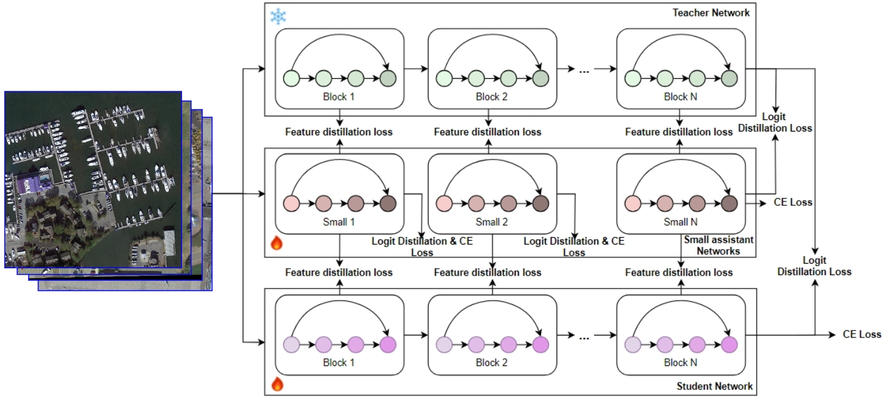
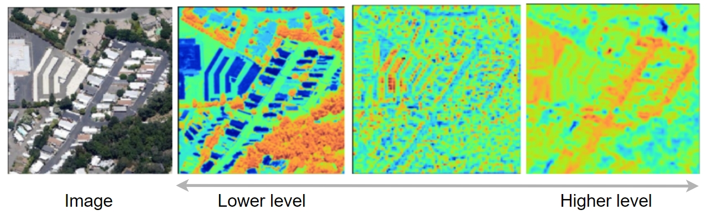
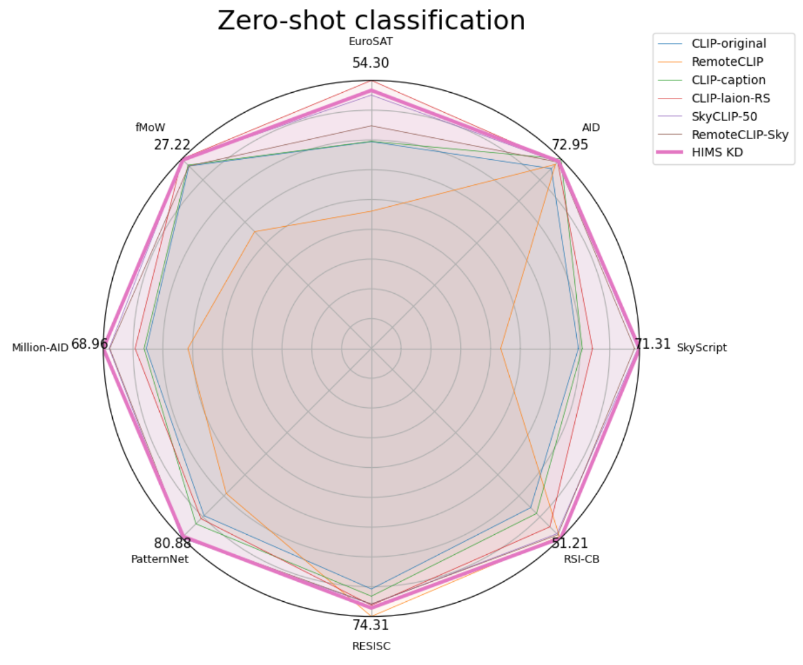
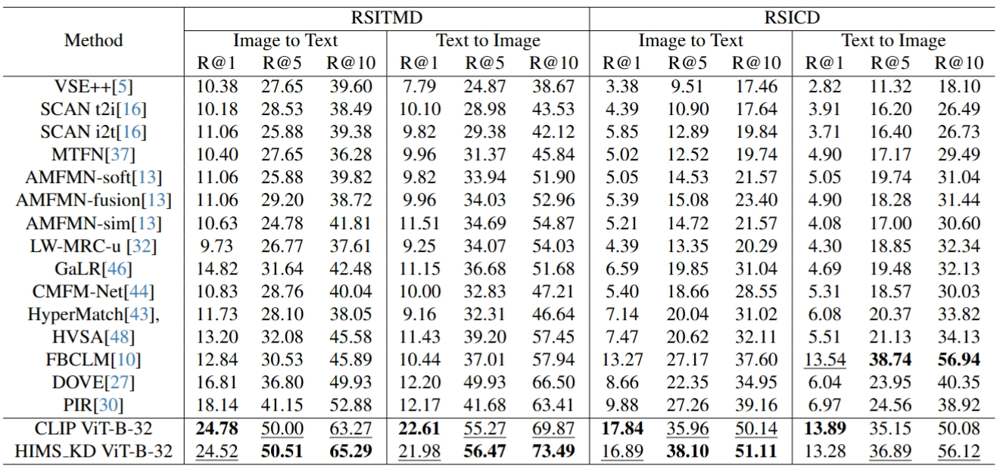

# Hierarchical Multi-Segment Knowledge Distillation (HIMS_KD)
<div align="center">
  


</div>

## News 🚀🚀🚀

- `2025/03/07`: This work has been submitted to **ICCV 2025**. The code and pre-trained models will be made publicly available upon acceptance.
  
## Introduction
This repository contains the implementation of **Hierarchical Multi-Segment Knowledge Distillation (HIMS_KD)**, a novel methodology designed to improve the efficiency and effectiveness of knowledge transfer in remote sensing applications. The framework employs a multi-stage distillation process to transfer knowledge from a large teacher model to a smaller student model, enabling the student to capture a more nuanced understanding of the teacher's knowledge.
<div align="center">
  
</div>


## Result
<div align="center">


</div>


## Installation

To get started with HIMS_KD, follow these steps:

1. **Clone the repository**:
   ```bash
   git clone https://github.com/pipe1223/HIMS_KD.git
   cd HIMS_KD

